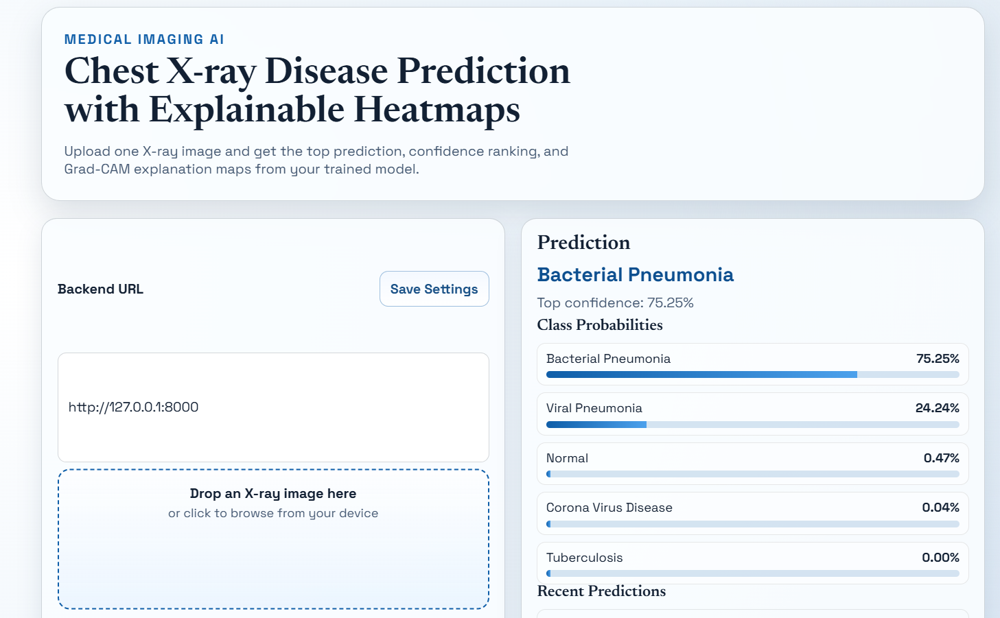
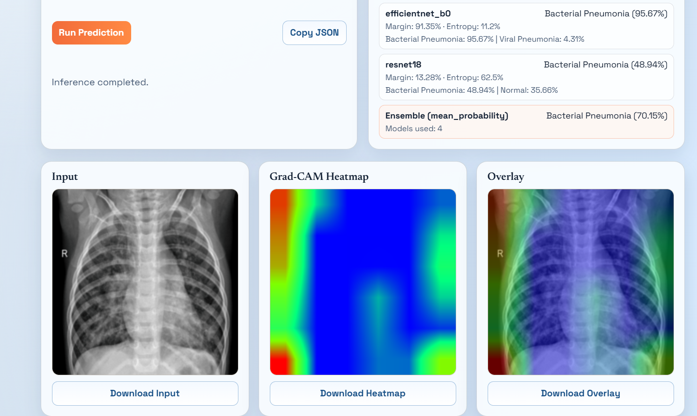
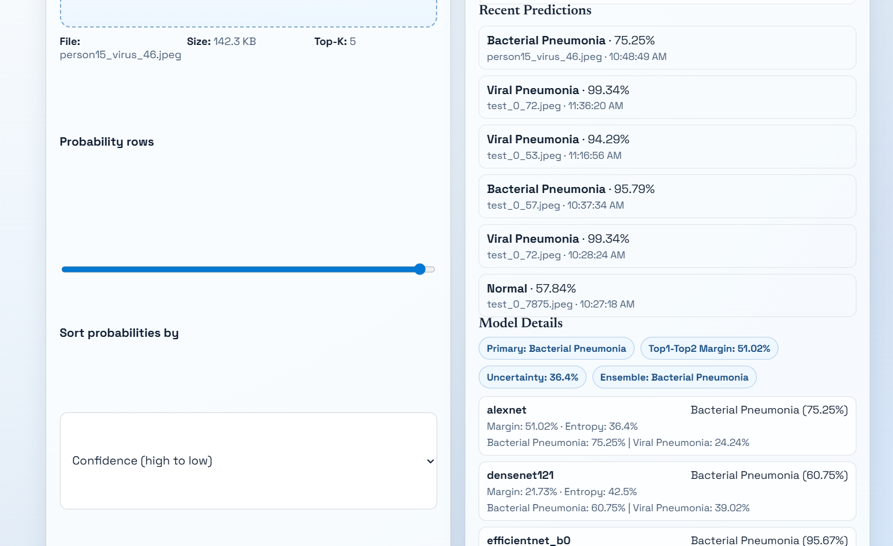

# Chest X-ray Disease Classifier 

An end-to-end locally runnable project for training, evaluating, and serving chest X-ray classifiers with explainable Grad-CAM visualizations.

This repository includes a training and evaluation pipeline, production-ready inference backend (FastAPI), and a responsive frontend for running predictions and viewing Grad-CAM explanations.

---

## Features

- Train and evaluate multiple backbones (AlexNet, ResNet18, DenseNet121, EfficientNet-B0)
- Test-time augmentation (TTA) and Grad-CAM explanations
- Saliency map generation and stability metrics (IoU, SSIM, Pearson)
- Export deployment bundles (`*_deployment.pt`) for fast inference
- FastAPI-based inference server with ensemble support
- Lightweight frontend to upload X-rays and visualize explanations

## Tech Stack

- Python 3.8+
- PyTorch, torchvision
- FastAPI + Uvicorn
- Pandas, NumPy, scikit-image
- Frontend: plain HTML/CSS/vanilla JS

## Demo (Local)

- Backend health: `GET /health`
- Model info: `GET /model`
- Predict (image upload): `POST /predict` (multipart form field: `file`)

## Deploy On Vercel

This repository is now configured to deploy the `frontend/` app on Vercel using `vercel.json`.

Live frontend URL:

- https://hns-major-project-9t5i.vercel.app/

## Screenshots

Preview screenshots (rendered inline). If the preview files are missing the placeholders below will still be shown.

<table>
  <tr>
    <td align="center">
      
      <div><strong>Input</strong></div>
    </td>
    <td align="center">
      
      <div><strong>Grad-CAM Heatmap</strong></div>
    </td>
    <td align="center">
      
      <div><strong>Overlay</strong></div>
    </td>
  </tr>
</table>

To replace these images, copy your screenshots into `frontend/screenshots/` and name them exactly:

- `input_preview.png` — input X-ray image
- `heatmap_preview.png` — Grad-CAM heatmap
- `overlay_preview.png` — overlay of heatmap on input

If you prefer the original SVG placeholders, they are still included below as fallbacks.


## Quick Start

1. Clone the repository:

```bash
git clone <repo-url>
cd "major project"
```

2. Install dependencies:

```bash
pip install -r requirements.txt
```

3. Start the backend (default looks for a deployment bundle under `outputs_paper_seed3_ep10`):

```bash
uvicorn backend.app:app --reload --host 127.0.0.1 --port 8000
```

If you want to point to a specific deployment bundle, set the `MODEL_BUNDLE_PATH` environment variable before starting the server. Example (PowerShell):

```powershell
$env:MODEL_BUNDLE_PATH="C:\path\to\bundle_deployment.pt"
uvicorn backend.app:app --reload --host 127.0.0.1 --port 8000
```

4. Serve the frontend (separate terminal):

```bash
cd frontend
python -m http.server 5500
# open http://127.0.0.1:5500
```

5. Run a quick curl sanity check:

```bash
curl http://127.0.0.1:8000/health
curl http://127.0.0.1:8000/model
```

---

## Folder Structure

```
important.txt
pipeline.ipynb
pipeline.py         # Training & evaluation pipeline
backend/            # FastAPI backend + inference helpers
frontend/           # UI: index.html, styles.css, app.js
dataset/            # train/ val/ test/ class folders (expected layout)
outputs_paper_seed3_ep10/  # training outputs & deployment bundles
```

## Usage

- Training and experiments are driven by `pipeline.py`. It auto-detects `dataset/train`, `dataset/val`, `dataset/test` and saves results under `outputs_paper_seed3_ep10` by backbone/config.
- Inference bundles are created using `save_deployment_bundle(...)` and have the suffix `_deployment.pt`.
- The frontend posts images to `/predict` and displays returned base64 PNGs for input, heatmap, and overlay.

## API Endpoints

- `GET /health` — basic server and model status
- `GET /model` — currently loaded model metadata and available representative bundles
- `POST /predict` — accepts multipart-form `file` and returns class probabilities, analysis, and Grad-CAM images (base64 PNG)

## Environment Variables

- `MODEL_BUNDLE_PATH` — optional: absolute path to a `_deployment.pt` bundle to override auto-discovery.

Example `.env` snippet:

```env
MODEL_BUNDLE_PATH=C:\absolute\path\to\resnet18_run0_deployment.pt
```

---

## Challenges & Learnings

- Training stability and reproducibility: pipeline sets deterministic CUDA flags to ensure reproducible runs (may reduce throughput).
- Grad-CAM consistency across backbones required careful selection of target layers and backward hooks.
- Building a minimal, user-friendly frontend helped quickly validate deployment bundles during development.

## Future Improvements

- Add authentication and rate-limiting to the API for secure deployments.
- Containerize the backend and provide a `docker-compose` setup.
- Add automated tests and CI to validate model loading and prediction endpoints.
- Provide a model management UI to switch representative bundles at runtime.

## License

This repository is provided as the **Premium edition**. Usage, redistribution, and commercial deployment require an explicit license from the project owner. Contact the maintainer for licensing terms.

If you want to switch to an open-source license, add a `LICENSE` file with your chosen SPDX identifier (for example, `MIT`).
